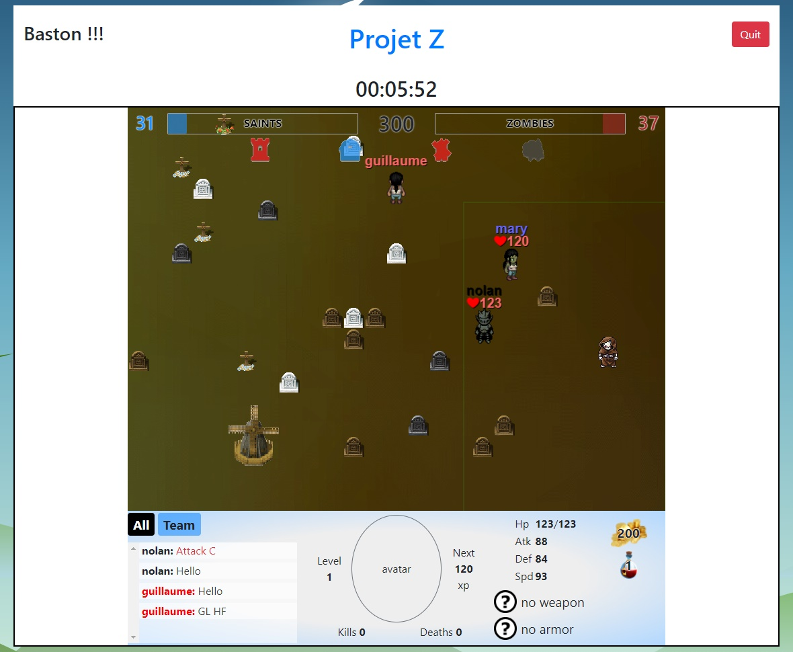

# Portfolio - Projet Z
[> Page détaillé de l'exercice sur mon site <](neo-explorer.com/portfolio/projetz "Page de l'exercice sur mon site")

Projet réalisé avec une petite équipe sur une durée d'un mois. L'objectif fut de créer un site web grâce au framework Symfony, qui permettrait aux utilisateurs d'accéder à un jeu vidéo multijoueur développé à l'aide du framework HTML5 : Phaser, le tout en les connectants entre eux via les technologies Node.js et Socket.IO.

## Principe
Le principe de ce site est simple : en prenant comme support Symfony, réaliser une application qui permet de mettre en relation plusieurs utilisateurs à travers un jeu vidéo. Ce dernier devra utiliser des technologies permettant une communication en temps réel. les technologies JavaScript utilisées sont les suivantes suivantes :

* Phaser (un framework de jeu en HTML5)
* Socket.IO (pour la communication client/serveur)
* Node.js (réceptionne, traite et envoi des données aux clients)

## Règles du jeu
La partie oppose deux équipes de trois joueurs réparties dans deux factions : les zombies et les saints. Afin de décrocher la victoire, il faudra atteindre avant vos adversaire un score de 300 points obtenable en capturant les zones (au nombre de 4) de la carte. Pour y parvenir, il vous suffit de rester à proximité celle-ci et de patienter quelques secondes, mais attention, si deux joueurs ennemis se trouvent au même endroit, la capture sera mis en pause et il faudra vous débarrasser de votre adversaire afin de pouvoir vous emparer de la zone. De plus, il est tout à fait possible de capturer une zone contrôlée par l'équipe adversaire, cependant cela prendra plus de temps car il vous faudra tout d'abord annuler l'appartenance de la zone concernée à vos ennemi pour pouvoir ensuite être capable de vous en emparer.

Pour abattre vos opposant vous disposez d'une attaque à l'épée dont les dégâts dépendent de votre statistique d'attaque et de la défense de votre ennemi. Par ailleurs, à chaque fois que vous mettrez à terre un adversaire vous obtiendrez des pièces d'or dépensables chez le marchand dans des potions de soins et des armes et armures vous permettant d'infliger plus de dégâts et d'en subir moins. Néanmoins tuer par un adversaire ne signifiera pas pour autant qu'il sera incapable de continuer la partie. Il ne pourra tout simplement plus y participer pendant quelques secondes, ce qui donnera un avantage numérique à votre équipe, mais passé ce délai il réaparaitra chez lui.

